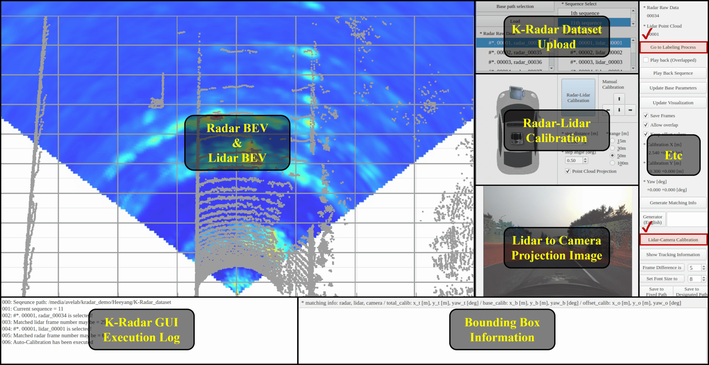
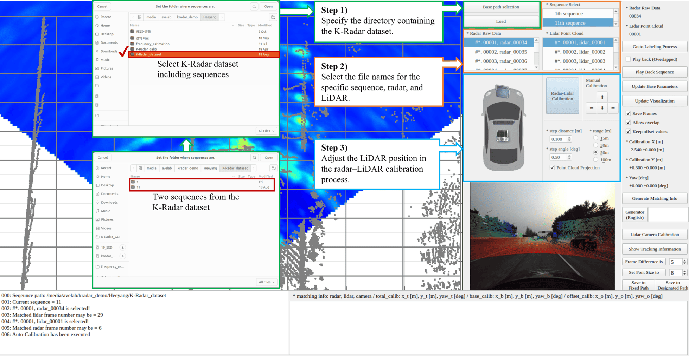
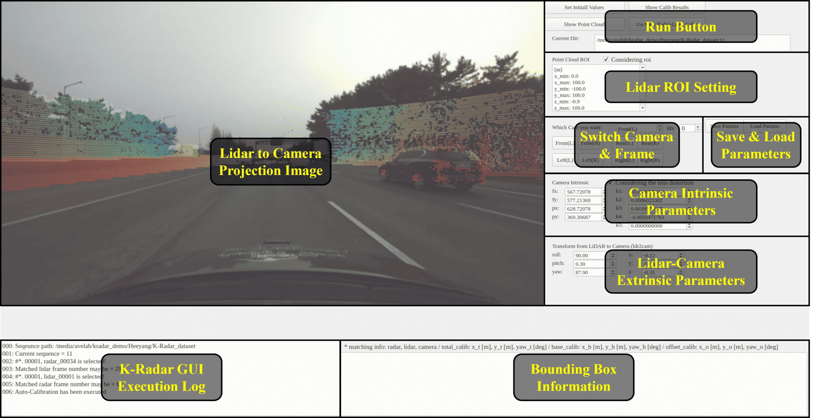
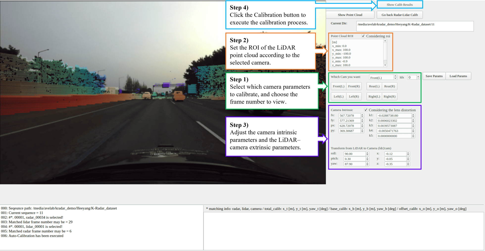
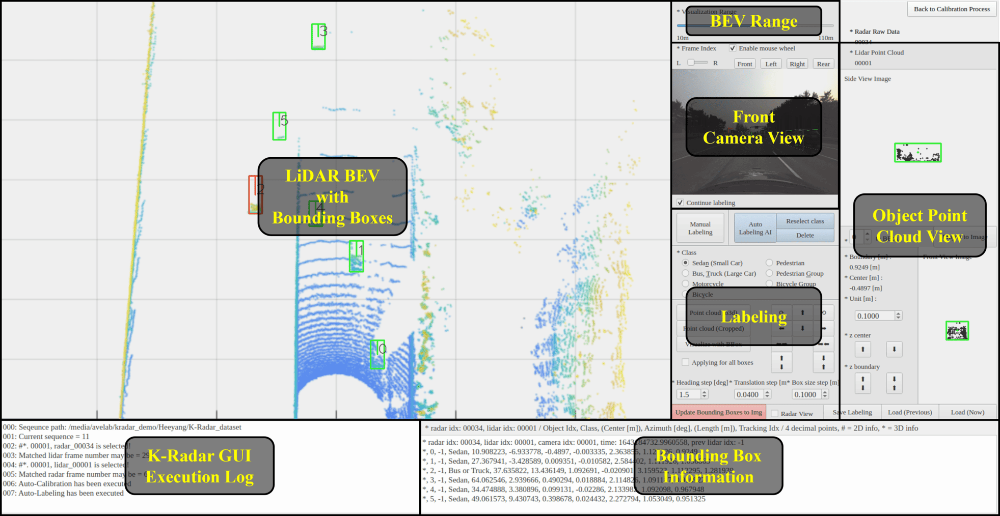
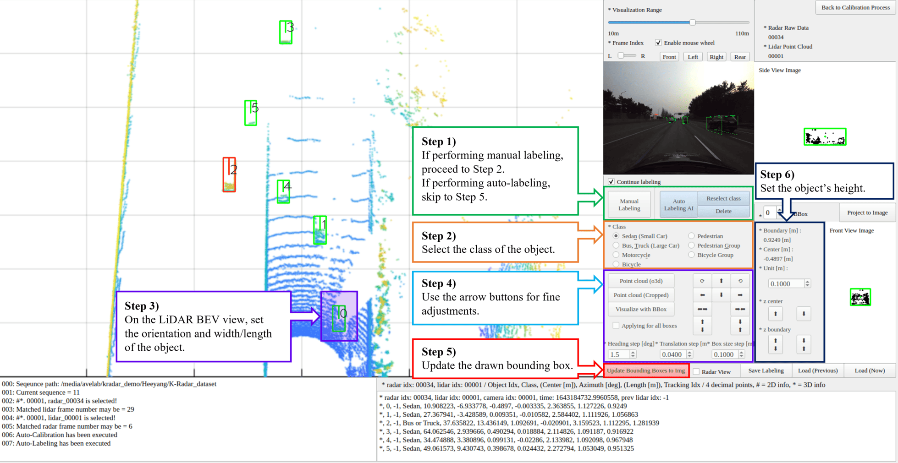

# K-Radar GUI

We provide a dedicated GUI tool for labeling datasets such as the K-Radar dataset, which is designed for perception AI model training. The K-Radar GUI supports both calibration and labeling, and this document explains how to install and use it.


## 1. Environment Setup

The K-Radar GUI has been tested under the following environment:

- Python 3.8.13 (Note: Python 3.10.x does not support Open3D.)
- Ubuntu 22.04 (also works on 20.04)
- CUDA 11.8

### Required Python Packages
- Torch 2.0.0+cu118  
- OpenCV 4.2.0.32  
- Open3D 0.15.2  

---

### 1.1. Data Preparation

Before using the GUI, you must prepare a dataset that follows the K-Radar dataset folder structure.  
Below is the minimum required directory configuration to run the K-Radar GUI.  
The K-Radar dataset consists of 58 sequences, each collected under different weather and environmental conditions.  

For more details, please refer to the [K-Radar dataset documentation](https://github.com/kaist-avelab/K-Radar/blob/main/docs/dataset.md).

```
K-Radar_dataset                 
    ├── 1
        ├── cam-front
        ├── cam-left
        ├── cam-rear
        ├── cam-right
        ├── info_label      (download from URL below)
        ├── lidar_bev_image (download from URL below)
        ├── os2-64          (Lidar point cloud)
        ├── radar_bev_image (download from URL below)
        ├── time_info   
    ...
    ├── 58
```

Download links
- Refined K-Radar labels: [info_label](https://drive.google.com/file/d/1hEN7vdqoLaHZFf7woj5nj4hjpP88f7gU/view)  
- Lidar BEV generation code: [main_save_lidar_frames_bev.py](https://github.com/kaist-avelab/K-Radar/tree/main/tools/movie_maker)  
- Radar BEV generation code: [main_save_radar_frames_bev.py](https://github.com/kaist-avelab/K-Radar/tree/main/tools/movie_maker)  

---

### 1.2. Installing K-Radar GUI

1. Clone the repository
   ```
   git clone https://github.com/kaist-avelab/K-Radar_GUI.git
   cd K-Radar_GUI
   ```

2. Create a conda environment
   ```
   conda create -n kradar_gui python=3.8.13 -y
   conda activate kradar_gui
   ```

3. Install PyTorch (We tested with version 2.0.0)

4. Install dependencies
   ```
   pip install -r requirements.txt
   pip install tqdm
   pip install shapely
   pip install SharedArray

   ### (if numpy >= 1.24) ###
   pip uninstall numpy 
   pip install numpy==1.23.0
   ```

5. Build packages for Rotated IoU
   ```
   cd utils/Rotated_IoU/cuda_op
   python setup.py install
   ```

6. Modify the NMS module code in packages  
   This step assumes you are inside the conda environment named `kradar_gui`,  
   e.g., `~/anaconda3/envs/kradar_gui/lib/python3.8/site-packages/nms`.
   ```
   Add line 11: 'from .nms import rboxes' in __init__.py of the nms module 
   Add line 39: 'rrect = tuple(rrect)' and comment out line 41: 'print(r)' in nms.py of nms module
   ```

7. Build packages for OpenPCDet operations
   ```
   cd ../../../ops
   python setup.py develop
   ```

8. Run the K-Radar GUI
   ```
   python main.py
   ```


## 2. How to Use K-Radar GUI

The K-Radar GUI consists of three main functionalities:
- Radar–Lidar calibration  
- Camera–Lidar calibration  
- Labeling (manual and auto-labeling)

---

### 2.1. Radar–Lidar Calibration

#### Interface Overview
When you launch K-Radar GUI, the first screen you’ll see is the Radar–LiDAR Calibration interface.  
Here, you can upload both radar and LiDAR data for calibration.  
When you upload both radar and LiDAR data, the corresponding camera image will be automatically loaded for calibration.



#### How to Perform Radar–Lidar Calibration
The “Radar–Lidar Calibration” button in the K-Radar GUI uses pre-calibrated external parameters.  


---

### 2.2. Lidar–Camera Calibration

#### Interface Overview  
In the calibration interface, run `Lidar–Camera Calibration` from the Radar–Lidar calibration menu.  


#### How to Perform Lidar–Camera Calibration
Before adjusting parameters, ensure that the [calib_seq_v2](https://github.com/kaist-avelab/K-Radar/tree/main/resources/cam_calib) directory is available.  


#### Camera Index Used in the K-Radar Dataset
<p align="center">
  
</p>

---

### 2.3. Labeling

#### Interface Overview
In the calibration interface, select `Go to Labeling Process`.


#### Labeling Procedure



## 3. Directory Structure After Installation

```
K-Radar_GUI                 
    ├── configs
    ├── datasets
    ├── models
    ├── ops (from K-Radar repository)
    ├── pipelines
    ├── project
        ├── auto-label
            ├── configs
            ├── datasets
            ├── LODN_model_log (download from URL below)
            ├── pipelines
            ├── RTNH_model_log (download from URL below)
            ├── utils  
    ├── resources
        ├── calib_seq_v2 (download from URL below)
    ├── tools
    ├── uis
    ├── utils
```

Download links
- Pretrained Lidar object detection model: [LODN_model_log](https://drive.google.com/file/d/1wckO9tPC75chCGrQL7al-pCmTBmBYyQ5/view?usp=drive_link)  
- Pretrained 4D radar object detection model: [RTNH_model_log](https://drive.google.com/file/d/1xBEC2zNQVwtOv8aBqslnKQVbUE-LXlki/view?usp=drive_link)  
- Camera–Lidar extrinsic parameters: [calib_seq_v2](https://github.com/kaist-avelab/K-Radar/tree/main/resources/cam_calib)

> The `project` directory includes functions required for [auto-labeling](https://github.com/kaist-avelab/K-Radar/blob/main/docs/labeling.md).
